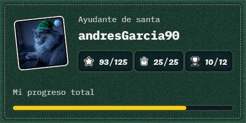

<h1 align="center">Advent Js 2024</h1>
<h3 align="center">Resolution of problematic in AdventJs</h3>
<h3 align="center">This project was created resolving the problems in the site  <a href="https://adventjs.dev/es"> adventjs.dev </a>.</h3>
<h3 align="center">Thanks Midudev to create this problems  <a href="https://midu.dev/"> midu.dev </a>.</h3>

|#| Retos | Solución | Resultado | Nivel |
| :-: | :-: | :-: | :-: | :-: |
|01| Reto #1: 🎁 ¡Primer regalo repetido!| [Solution](./js/01-primer-regalo/README.md)|⭐⭐⭐⭐⭐| 🟢 |
|02| Reto #2: 🖼️ Enmarcando nombres| [Solution](./js/02-enmarcando_nombres/README.md)|⭐⭐⭐⭐⭐| 🟢 |
|03| Reto #3: 🏗️ Organizando el inventario | [Solution](./js/03-organizando_juguetes//README.md)|⭐⭐⭐⭐⭐| 🟢 |
|04| Reto #4: 🎄 Decorando el árbol de Navidad | [Solution](./js/04-decorando_el_arbol_de_navidad/README.md)|⭐⭐⭐⭐⭐| 🟠 |
|05| Reto #5: 👞 Emparejando botas | [Solution](./js/05-emparejando_botas/README.md)|⭐⭐⭐⭐⭐| 🟢 |
|06| Reto #6: 📦 ¿Regalo dentro de la caja? | [Solution](./js/06-regalo_dentro_de_la_caja/README.md)|⭐⭐⭐⭐⭐| 🟠 |
|07| Reto #7: 👹 El ataque del Grinch | [Solution](./js/07_el_ataque_del_grinch/README.md)|⭐⭐⭐⭐| 🟠 |
|08| Reto #8: 🦌 La carrera de renos | [Solution](./js/08-carrera_de_renos/README.md)|⭐⭐⭐| 🟢 |
|09| Reto #9: 🚂 El tren mágico | [Solution](./js/09_el_tren_magico/README.md)|⭐| 🟠 |
|10| Reto #10: 👩‍💻 El ensamblador élfico | [Solution](./js/10-el_esamblador_elfico/README.md)|⭐| 🟠 |
|11| Reto #11: 🏴‍☠️ Nombres de archivos codificados | [Solution](./js/11-nombres_de_archivos_codificados/README.md)|⭐⭐⭐⭐⭐| 🟢 |
|12| Reto #12: 💵 ¿Cuánto cuesta el árbol? | [Solution](./js/12-cuanto_cuesta_un_arbol/readme.md)|⭐⭐⭐| 🟢 |
|13| Reto #13: 🤖 ¿El robot está de vuelta? | [Solution](./js/13-robot-devuelta/readme.md)|⭐| 🔴 |
|14| Reto #14: 🦌 Acomodando los renos | [Solution](./js/14-Acomodando_los_renos/readme.md)|⭐⭐⭐⭐⭐| 🟢 |
|15| Reto #15: ✏️ Dibujando tablas | [Solution](./js/15-dibujando_tablas/readme.md)|⭐⭐⭐| 🟢 |
|16| Reto #16: ❄️ Limpiando la nieve del camino | [Solution](./js/16-limpiando_nieve/readme.md)|⭐⭐⭐⭐| 🟢 |
|17| Reto #17: 💣 Buscando las bombas del Grinch | [Solution](./js/17-busca_bombas/readme.md)|⭐⭐⭐| 🟠 |
|18| Reto #18: 📇 La agenda mágica de Santa | [Solution](./js/18-agenda_magica/readme.md)|⭐| 🔴 |
|19| Reto #19: 📦 Apila cajas mágicas para repartir regalos | [Solution](./js/19-apliar_cajas/readme.md)|nope| 🔴 |
|20| Reto #20: 🎁 Encuentra los regalos faltantes y duplicados | [Solution](./js/20-encuentre_los_regalos/readme.md)|⭐⭐⭐⭐⭐| 🟢 |
|21| Reto #21: 🎄 Calcula la altura del árbol de Navidad | [Solution](./js/21-calcula_la_altura/readme.md)|⭐| 🟢 |
|22| Reto #22: 🎁 Genera combinaciones de regalos | [Solution](./js/22-genera_regalos/readme.md)|⭐⭐⭐⭐⭐| 🟠 |
|23| Reto #23: 🔢 Encuentra los números perdidos | [Solution](./js/23-encuentra_numeros/readme.md)|⭐⭐⭐⭐⭐| 🟢 |
|24| Reto #24: 🎁 Genera combinaciones de regalos | [Solution](./js/22-genera_regalos/readme.md)|⭐⭐⭐| 🟠 |
|25| Reto #25: 🪄 Ejecuta el lenguaje mágico | [Solution](./js/25-ejecuta_el_lenguaje/readme.md)|⭐⭐⭐⭐⭐| 🟠 |
